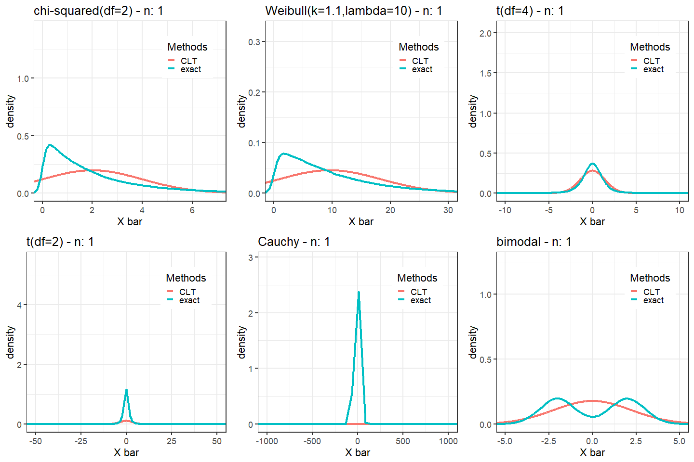

 

```{r setup, include=FALSE}
# Suppress warnings for all the packages here
# Then all of the warnings wont come up when we
# use the library(X) commands in R scripts below.
suppressPackageStartupMessages(require(tufte))
suppressPackageStartupMessages(require(tidyverse))
suppressPackageStartupMessages(library(plotly))
# invalidate cache when the tufte version changes
knitr::opts_chunk$set(tidy = FALSE, cache.extra = packageVersion('tufte'))
options(htmltools.dir.version = FALSE)

# Set the seed for reproducibility
set.seed(1)
```


# Intro Banter


# Central limit theorem

The central limit theorem is one of the most powerful theorems in statistics.
There are many versons of it but lets look at the most simple one. Lets
assume that

(1) ${\bf X} = (X_1,\ldots,X_n)$ is a vector of $n$ random variables,

(2) that are indepedently drawn,

(3) from the same distribution,

(4) with (exisiting) mean $\mu = {\mathbb E}(X_i)$ and 

(5) finite variance $\sigma^2 = \mbox{Var}(X_i) < \infty$.

Let $\overline{X}$ denote the average of the $X_i$'s, i.e.,
$$
\overline{X} = \frac{1}{n}\sum_{i=1}^n X_i 
$$

Then for for large enough $n$ we have
$$
\overline{X} \stackrel{D}{\to} N\left(\mu,\frac{\sigma^2}{n} \right)
$$
where $\stackrel{D}{\to}$ is used to denote convergence in distribution. 

# Understanding the convergence in distribution bit

To give some intuition about what "convergence in distribution" means suppose
we have $N$ collections of samples (of the same size $n$ and assumptions (1) to (5)),
that is,

* ${\bf X}^{(1)} = (X_1^{(1)},\ldots,X_n^{(1)})$

* ${\bf X}^{(2)} = (X_1^{(2)},\ldots,X_n^{(2)})$

* $\ldots$

* ${\bf X}^{(N)} = (X_1^{(N)},\ldots,X_n^{(N)})$

and for each of these $N$ samples we calculate the mean

* $\overline{\bf X}^{(1)} = \frac{1}{n}\sum_{i=1}^n X_i^{(1)}$

* $\overline{\bf X}^{(2)} = \frac{1}{n}\sum_{i=1}^n X_i^{(2)}$

* $\ldots$

* $\overline{\bf X}^{(N)} = \frac{1}{n}\sum_{i=1}^n X_i^{(N)}$

then the collection of these $\overline{\bf X}^{(1)},\ldots, \overline{\bf X}^{(N)}$
will be approximately normally distributed with mean $\mu$ and variance 
$\sigma^2/n$.

We want to show how the CLT works.... but on a distribution which is not normally
distributed.


# The CLT in action

We will want to do this same thing multiple times so let's put it in a 
generic function.
 

```{r}
generate_plot_data <- function(N,n_val,rdist,...)
{  
  # Initialize data for N datasets of size n
  X_mat <- matrix(rdist(N*n_val, ...),N,n_val)
  
  # Calculate the means
  x_bar <- apply(X_mat,1,mean)

  # Approximate the distribution of x_bar
  dens <- density(x_bar)
  
  # Stores the data
  dat1 <- cbind(x=dens$x,y=dens$y, n_val)
  colnames(dat1) <- c("x","y","n_val")
  
  # Approximate the mean and variance of the distribution
  mu <- mean(X_mat)
  sigma2 <- var(as.vector(X_mat))
  
  # Calculate the parameters of the CLT distribution
  mu_CLT     <- mu
  sigma2_CLT <- sigma2/n_val
  sigma_CLT  <- sqrt(sigma2_CLT)
  
  # 
  xg <- seq(mu_CLT - 5*sigma_CLT,mu_CLT + 5*sigma_CLT,,1000)
  fg <- dnorm(xg,mu_CLT,sigma_CLT)
  dat2 <- cbind(xg,fg,n_val)
  colnames(dat2) <- c("x","y","n_val")

  tib1 <- as_tibble(dat1)
  tib2 <- as_tibble(dat2)
  tib1 <- tib1 %>% add_column(method="exact")
  tib2 <- tib2 %>% add_column(method="CLT")
  tib <- bind_rows(tib1,tib2)
  
  return(tib)
}
```

Plot the the case when $n=5$

```{r, cache=TRUE}
k <- 1.1
lambda <- 10

# Call the function
tib <- generate_plot_data(N=100000,n_val=2, rweibull, shape=k, scale=lambda)  %>% add_column(dist="weibull")
```

```{r}
# Plot the results
g <- ggplot(tib,aes(x=x,y=y,color=method)) +
  geom_line(size=1.5) +
  theme_bw() +
  labs(color="Methods",x='X bar',y='density')
g 
```


The code used to create the animation below can be found  
[here](CLT_supp.html).

<center>

</center>

# A practical example

```{r}
library(Ecdat)


N <- 1000

trapint <- function(xgrid, fgrid) 
{
	ng <- length(xgrid)
	xvec <- xgrid[2:ng] - xgrid[1:(ng - 1)]
	fvec <- fgrid[1:(ng - 1)] + fgrid[2:ng]
	integ <- sum(xvec * fvec)/2
	return(integ)
}

X <- VietNamI %>% na.omit()

vn <- seq(10,200,by=5)
mErr <- matrix(0,length(vn),ncol(X))

for (k in 1:ncol(X))
{
  if (is.numeric(X[,k])) {
    
    x <- X[,k]
    n <- length(x)
    
    
    
    mu <- mean(x)
    sigma2 <- var(x)
    
    
    for (j in 1:length(vn))
    {
      x.bar <- c()
      for (i in 1:N)
      {
        inds <- sample(n,vn[j])
        x.samp <- x[inds]
        x.bar[i] <- mean(x.samp)
      }
      
      dens <- density(x.bar)
      #plot(dens)
      
      mu_CLT <- mu
      sigma2_CLT <- sigma2/vn[j]
      sigma_CLT <- sqrt(sigma2_CLT)
      
      xg <- dens$x
      yg <- dnorm(xg,mu_CLT,sigma_CLT)
      #lines(x,y,col="red",lwd=2)
    
      mErr[j,k] <- 0.5*trapint(xg,abs(yg - dens$y))
      
      cat(j,k,vn[j],colnames(X)[k],mErr[j,k],"\n")
    }
    
    plot(vn,mErr[,k],type="l") 
  }
}

```


# Why it works - Part 1
 
Assume $\mu$ and $\sigma^2$ exists.
Define
$$
Y_i = \frac{X_i - \mu}{\sigma}
$$
Define
$$
Z = \frac{1}{\sqrt{n}} \sum_{i=1}^n Y_i
$$
Using properties of expectations and variances it can be shown
$$
{\mathbb E}(Z) = 0 
\qquad \mbox{and} \qquad 
\mbox{Var}(Z) = 1. 
$$
We are going to use two special functions

* __Moment generating functions__: The moment generating function (MGF)
of a RV $X$ as a function of $t$ is defined as 
$$
M_X(t) = {\mathbb E}\left[ \exp(tX) \right]
$$

* __Cumulant generating functions__: The cumulant generating function (CGF)
of a RV $X$ as a function of $t$ is defined as 
$$
K_X(t) = \log M_X(t)
$$

Some useful properties of MGFs and CGFs include:

* The MGF and CGF uniquely identify a distribution.

* The CGF for the $X\sim N(0,1)$ is $K_X(t) = t^2/2$.

* $K_Y'(0) = {\mathbb E}(Y)$  and K_Y''(0) = \mbox{Var}(Y)$.

Now the MGF of $Z$ defined above is:
$$
\begin{array}{rl}
M_{Z}(t) 
& \displaystyle = {\mathbb E}\left[ \exp(tZ) \right]
& \qquad \mbox{(Definition)}
\\
& \displaystyle = {\mathbb E}\left[ \exp\left( \frac{t}{\sqrt{n}} \sum_{i=1}^n Y_i  \right) \right]
& \qquad \mbox{(Definition)}
\\
& \displaystyle = \prod_{i=1}^n {\mathbb E}\left[ \exp\left( \frac{t}{\sqrt{n}}  Y_i  \right) \right]
& \qquad \mbox{(Independence and properties of exp)}
\\
& \displaystyle = \prod_{i=1}^n  \left[  M_Y\left( \frac{t}{\sqrt{n}} \right) \right]^n 
& \qquad \mbox{(Identically distributed)}
\end{array} 
$$
Hence, the CGF of $Z$ satisfies:
$$
\begin{array}{rll}
K_Z(t) 
& = \log M_{Z}(t)  & \mbox{(Definition)}
\\
& = n \log M_Y\left( \frac{t}{\sqrt{n}} \right) & \mbox{(From Above)}
\\ 
& = n K_Y\left( \frac{t}{\sqrt{n}} \right) & \mbox{(Definition)}
\end{array}
$$

We can also establish that:
$$
K_Y'(0) = {\mathbb E}(Y) = 0 
\qquad \mbox{and} \qquad 
K_Y''(0) = \mbox{Var}(Y) = 1. 
$$


```{marginfigure}
__L'Hopital's rule__ (under appropriate conditions) that
that for differentiable functions $f(x)$ and $g(x)$ 
that if $\lim_{x\to c} f(x)/g(x),$
is an indetermiant form, e.g., $0/0$, $\infty/\infty$
then
$$
\displaystyle \lim_{x\to c} \frac{f(x)}{g(x)} = \lim_{x\to c} \frac{f'(x)}{g'(x)}.
$$
  
assuming the right hand side exists.
```

Now we use 
[L'Hopital's rule](https://en.wikipedia.org/wiki/L%27H%C3%B4pital%27s_rule)
twice to obtain
$$
\begin{array}{rl}
\displaystyle \lim_{n\to\infty} K_Z(t)
& \displaystyle = \lim_{n\to\infty} n K_Y\left( \frac{t}{\sqrt{n}} \right) 
\\
& \displaystyle = \lim_{\Delta\to 0} \frac{ K_Y\left( \Delta t \right)}{\Delta^2} 
\\
& \displaystyle = \lim_{\Delta\to 0} \frac{ t K_Y'\left( \Delta t \right)}{2\Delta} \qquad \mbox{(L'Hopital's rule)} 
\\
& \displaystyle = \lim_{\Delta\to 0} \frac{ t^2 K_Y''\left( \Delta t \right)}{2} \qquad \mbox{(L'Hopital's rule)}
\\
& = \displaystyle \frac{t^2}{2}
\end{array}
$$

which is the cumulant generating function of the nomral distribution.
Hence, the CGF of $Z$ approaches that of a normal distirubiton.

 


 

<div align="center">
   <iframe width="560" height="315" src="https://player.vimeo.com/video/75089338" frameborder="0" allowfullscreen>
   </iframe>
</div>


